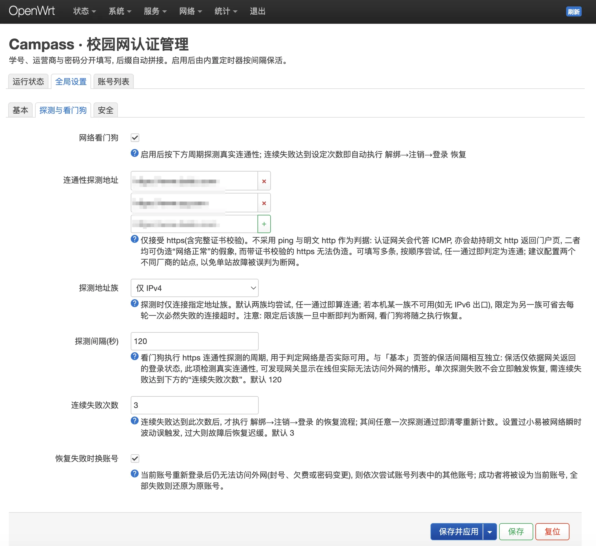
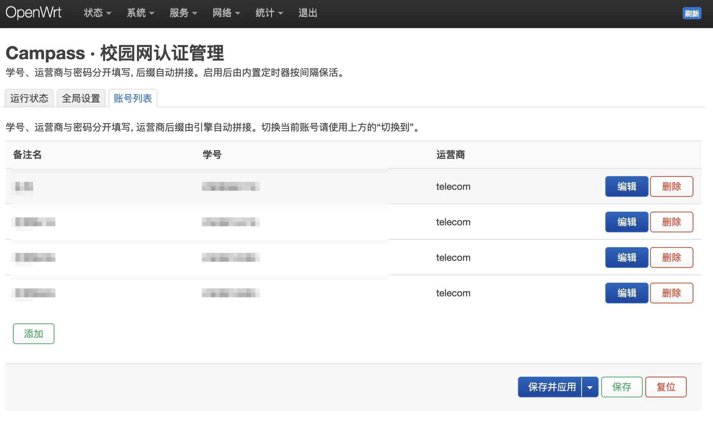

# Campass

> 路由器上的**校园网认证管理**服务，为 OpenWrt 打造：自动认证、保活、断网自愈、多账号切换。

Campass 是一个 Rust 引擎 + LuCI 界面的 OpenWrt 应用：路由器开机 / 掉线自动认证校园网，内置定时保活与网络看门狗，多账号带验证切换（切坏了自动回滚），彻底告别手写 cron 脚本。

Campass speaks the **Dr.COM / eportal** web-auth protocol used by many Chinese campus networks.





## 特性

- **自动登录** —— 路由器开机 / 掉线自动认证，无需手动点门户页。
- **内置定时器保活** —— procd 服务按间隔检测，未在线即登录。
- **网络看门狗** —— 以独立频率探测真实连通性，连续失败达到设定次数即自动 `解绑 → 注销 → 登录` 恢复。
- **账号故障转移** —— 恢复后仍上不了网（封号 / 欠费 / 改了密码），自动依次试列表里的其他账号，通了就设为当前账号。
- **带验证的账号切换** —— 一键换号，切完在验证窗口内确认真能上网；不通就**自动回滚原账号**，不怕把自己关在门外。
- **抗劫持的连通性判定** —— 只认带**证书校验**的 https。ping 和明文 http 都能被认证网关伪造，不作数（[为什么](#连通性探测)）。
- **多账号管理** —— LuCI 里增删账号，学号 / 运营商 / 密码分开填，后缀自动拼接。
- **认证响应留存** —— 登录 / 注销 / 解绑的原始返回（含切换与回滚全过程）留在界面上，随时展开排错。
- **会话信息** —— 当前账号的欠费、剩余时长 / 流量、本次与累计用量，取自网关实时返回。
- **状态面板 + 运行日志** —— 在线状态、uid、公网 IP、上次登录，实时刷新。
- **防误触** —— 登出 / 解绑需输入**操作口令**二次确认。
- **防篡改** —— 一键写防火墙规则，禁止 LAN 用户直接访问认证网关，但不影响他们上网。
- **运营商后缀** —— 电信 `@telecom` / 移动 `@cmcc` / 联通 `@unicom` / 桂林广电 `@glgd` / 校园网（无后缀）。也可自定义：`isp` 填任意后缀（如 `abc` 或 `@abc`，都会得到 `@abc`），LuCI 里那一栏是可编辑下拉框。

## 组成

| 包 | 内容 |
|----|------|
| `campass` | Rust 引擎 `/usr/bin/campass` + procd 服务 + rpcd 接口 + UCI 配置 |
| `luci-app-campass` | LuCI 界面（服务 → Campass） |

## 目录结构

```
campass-rs/            Rust 引擎源码（静态 musl 二进制）
pkg/campass/           campass 包（CONTROL + data 安装树）
pkg/luci-app-campass/  LuCI 包
build.sh               交叉编译 + 打包两个 .ipk（无需 OpenWrt SDK）
docs/                  截图
```

## 安装

**方式一：在路由器上直接下载安装（推荐）**

ssh 进路由器，整段粘贴即可——自动认架构、下载、安装、清理：

```sh
VER=1.9.0
ARCH=$(opkg print-architecture | awk '$1=="arch" && $2!="all" && $2!="noarch" {print $2, $3}' \
       | sort -k2 -nr | head -1 | cut -d' ' -f1)
BASE=https://github.com/wilinz/campass-openwrt/releases/download/v$VER

cd /tmp && \
wget -O campass.ipk  "$BASE/campass_${VER}_${ARCH}.ipk" && \
wget -O luci-app.ipk "$BASE/luci-app-campass_${VER}_all.ipk" && \
opkg install campass.ipk luci-app.ipk; \
rm -f campass.ipk luci-app.ipk
```

> - `ARCH` 那行取的是 `opkg print-architecture` 里优先级最高的具体架构（排除 `all` / `noarch`）。想手动指定就直接写，例如 `ARCH=mipsel_24kc`。
> - 架构名不完全匹配时给 `opkg install` 加 `--force-architecture`——引擎是静态 musl 二进制，同 CPU 家族通用。
> - `wget` 在 OpenWrt 上通常是 `uclient-fetch`。若报 https 相关错误，先装证书：`opkg update && opkg install ca-bundle libustream-mbedtls`。

也可以自己去 [Releases](https://github.com/wilinz/campass-openwrt/releases) 挑对应架构的 `campass_*_<架构>.ipk` 和架构无关的 `luci-app-campass_*_all.ipk` 下载后 `opkg install`。

**方式二：本地构建后推送**

```sh
scp out/campass_*.ipk out/luci-app-campass_*.ipk root@路由器:/tmp/
ssh root@路由器 'opkg install /tmp/campass_*.ipk /tmp/luci-app-campass_*.ipk'
```

> 路由器上没有 `sftp-server` 时 `scp` 会失败（busybox 环境常见），改用管道：
> `ssh root@路由器 'cat > /tmp/campass.ipk' < out/campass_*.ipk`

安装后服务默认**休眠**（`enabled=0`）。进 LuCI **服务 → Campass**，填好账号、勾选「启用」并保存应用即可。升级时 `/etc/config/campass` 会保留，新增选项由 postinst 补默认值。

## 支持的架构

每次打 tag，CI 交叉编译并发布覆盖 13 种 opkg 架构的预编译包（[Releases](https://github.com/wilinz/campass-openwrt/releases)）。引擎为静态 musl 二进制，同 CPU 家族内可 `--force-architecture` 通用。

| opkg 架构 | rust target | 典型设备 | 证书校验 |
|-----------|-------------|----------|:--------:|
| `x86_64` | `x86_64-unknown-linux-musl` | 软路由 / x86-64 | ✅ |
| `i386_pentium4` | `i686-unknown-linux-musl` | 老 32 位 x86 软路由 | ✅ |
| `aarch64_generic` / `cortex-a53` / `cortex-a72` | `aarch64-unknown-linux-musl` | 树莓派、多数新 64 位 ARM 路由 | ✅ |
| `arm_cortex-a7` / `a9` / `a15` | `armv7-unknown-linux-musleabihf` | 32 位 ARM 路由 | ✅ |
| `riscv64_riscv64` | `riscv64gc-unknown-linux-musl` | VisionFive / D1 等 RISC-V | ✅ |
| `mipsel_24kc` | `mipsel-unknown-linux-musl` | MT7621 等主流家用路由（小端）| ✅ |
| `mips_24kc` | `mips-unknown-linux-musl` | ath79 等（大端）| ✅ |
| `mips64_octeonplus` | `mips64-unknown-linux-muslabi64` | Cavium Octeon（EdgeRouter Lite/PoE 等）| ✅ |
| `mips64el_generic` | `mips64el-unknown-linux-muslabi64` | 小端 64 位 MIPS | ✅ |
| `luci-app-campass_..._all` | — | 界面，**架构无关**，配任一引擎包 | — |

- mips / mips64 为 Rust tier-3 目标，用 nightly + `-Z build-std` + zig 交叉；mips_24kc（无 FPU）走软浮点。
- mips 系的证书校验已在 qemu-user 下逐个验证（含两个大端目标）：aws-lc-rs 能交叉编译，真握手成功，过期 / 自签证书会被正确拒绝。代价是引擎产物从 ~860KB 涨到 ~2.3MB（ipk ~0.95MB），4MB flash 的老机型可能装不下——那就自己 `FEATURES= ./build.sh` 编一个精简版。装好后 `campass probe` 的 `tls_verify` 字段会告诉你当前二进制是哪种。

## 连通性探测

「网络到底通没通」是本项目所有自动决策的依据——看门狗要不要重连、切换账号要不要回滚，全看它。**判据只有一个：对 `probe_url` 里的 https 目标完成 TLS 握手并通过证书链校验。**

为什么把看起来更简单的手段全否掉了：

| 手段 | 为什么不作数 |
|------|--------------|
| `ping` | 认证网关会**代答 ICMP**。实测在校园网里 ping `192.0.2.1`（TEST-NET 保留地址，本该完全不可达）照样 `ttl=64, 0.2ms` 秒回——ping 恒为「通」，拿它当判据等于把回滚保护整个关掉。 |
| 明文 http | 未认证时网关直接劫持返回门户页，「有响应」不等于能上网。靠页面特征（出现网关地址 / `drcom` / `eportal`）识别只是启发式，伪造成本极低。 |
| https 不验证书 | 只能证明对端会说 TLS，挡得住 http 劫持，但挡不住网关自建 CA 做中间人。 |

所以：列表里的 **http 条目会被直接跳过**，不参与判定；https 条目走 rustls + aws-lc-rs 的完整校验（根证书用 webpki-roots，全部 Rust 内建，不依赖 curl / wget）。网关就算劫持 443，也拿不出可信证书。

几个实现上的要点：

- **v4 / v6 分别试，任一通过即算连通。** 每个域名解析出的地址会逐个试到**整条探测走通**为止——不是「连上就算」。校园网常见「有 IPv6 地址但 v6 出口是黑洞」：TCP 握手能成、数据发不出去，只要连上就返回的话，TLS 会卡到超时，后面能用的 v4 地址根本轮不到；而 DNS 每次返回的地址顺序还会轮换，于是表现为时好时坏。
- **地址缓存。** 上次走通的地址记在 `/tmp/campass.addr` 并优先重试，否则每轮探测都要先耗掉 v6 的连接 / 读超时。
- **多写几个目标。** 默认给了 `www.baidu.com` 和 `www.qq.com` 两家，避免单站故障被误判成断网。
- **可以限定地址族。** `probe_family` 填 `v4` / `v6` 就只连那一族，默认 `any` 两族都试。本地某一族根本不可用时（比如压根没有 IPv6），限定成另一族能省掉每轮那次注定失败的连接超时。代价是**限定的那族一断就判为断网**，看门狗会跟着动作，所以别拿它当"屏蔽故障族"用——那是地址缓存该干的事。

`campass probe` 会按 v4 / v6 分别报告每个目标，界面上「诊断 → 测试连通性」是同一份数据。v6 不通时它要等超时，可能十几秒。注意这份报告**始终分族列出**（便于定位单边故障），而顶上的 `ok` 是按 `probe_family` 判的——限定了 `v4` 时 v6 那列仅供参考。

### 探测耗多少流量

看门狗每隔 `watchdog_interval` 就要跑一次，长年累月，所以这条路径上的流量值得抠一抠。实测（在路由器上用 nft 只统计到探测目标那条流，避开出口上的其他流量）：

| 做法 | 每次探测下行 | 按 120s 间隔折算 |
|------|------------:|----------------:|
| `GET /` + 每次重建 TLS 配置 | 16.4 KB | ~11.5 MB/天 |
| 改用 `HEAD` | 13.8 KB | ~9.7 MB/天 |
| `HEAD` + 复用 TLS 配置（当前） | **1.7 KB** | **~1.2 MB/天** |

两处优化，后者才是大头：

- **用 `HEAD` 而不是 `GET`。** 判据只看回没回一行 `HTTP/...` 状态行，body 一个字节都不需要。发 `GET` 的话服务器照常推首页，虽然读满 16 字节就断开，但断开前已经有一整个初始拥塞窗口的数据发出来了。（即便某些服务器对 `HEAD` 回 405 也无妨——判据是「有没有合法 HTTP 响应」，不看状态码。）
- **`ClientConfig` 进程内常驻。** 原来每次探测都重建配置，rustls 的会话缓存跟着丢，于是每次都得重新下载整条证书链再验一遍——这占了 13.8 KB 里的绝大部分。daemon 是长驻进程，配置复用后后续探测走简化握手，降到 1.7 KB；顺带省掉每次克隆整张根证书表和重复的链校验开销。

两点代价：daemon 重启后的**第一次**探测仍是全握手（~13.8 KB）；`campass probe`（命令行与界面按钮）是一次性进程，拿不到复用，每次约 15 KB——人工触发，不影响日常。

## 从源码构建

需要 `cargo-zigbuild` + `zig`（在任意平台交叉出静态 musl 二进制，无需 OpenWrt SDK）：

```sh
rustup target add x86_64-unknown-linux-musl
cargo install cargo-zigbuild        # 并安装 zig（brew install zig / 见其文档）
./build.sh                          # 默认 x86_64，产物在 out/
```

换架构由环境变量驱动，例如小端 MT7621：

```sh
TARGET=mipsel-unknown-linux-musl ARCH=mipsel_24kc BUILDSTD=1 FEATURES= ./build.sh
```

| 环境变量 | 含义 |
|----------|------|
| `TARGET` | rust 目标三元组 |
| `ARCH` | opkg 架构名 |
| `VERSION` | 版本号，默认取自 `CONTROL/control`（CI 用 tag 覆盖） |
| `BUILDSTD` | `1` = 用 nightly `-Z build-std`，mips 等 tier-3 目标必需 |
| `FEATURES` | cargo features，默认 `tls`（证书校验，全部发布架构实测可交叉编译，含 mips/mips64 大小端）；置空则不编入 aws-lc-rs，体积大致减去 1.4MB，探测退回握手校验 |
| `BUILD_ENGINE` / `BUILD_LUCI` | `1`/`0`，分别控制是否构建引擎包 / LuCI 包 |

> OpenWrt 的 `.ipk` 是 `debian-binary` + `control.tar.gz` + `data.tar.gz` 三个成员打成的 **gzip tar**（不是 Debian 的 `ar` 归档），`build.sh` 已按此格式打包。

## 命令行

```
campass login          读取当前账号并登录（已在线则跳过）
campass logout         注销下线
campass unbind         解绑当前账号在本机的 MAC
campass switch <sec>   切换到账号 section <sec>，验证失败自动回滚
campass switchstatus   输出切换任务进度 JSON
campass accounts       列出所有账号 JSON
campass probe          跑一次连通性探测，按 v4 / v6 分别报告
campass session        输出当前账号的会话信息 JSON（欠费 / 剩余时长 / 流量）
campass watchdog       跑一次看门狗检查（平时由 daemon 按间隔调度）
campass status         输出 JSON 状态
campass auth           输出保存的认证响应记录 JSON
campass clearauth      清空认证响应记录
campass log            输出运行日志
campass clearlog       清空运行日志
campass daemon         保活 + 看门狗循环（由 procd 拉起）
```

## 配置 `/etc/config/campass`

```
config campass 'global'
	option enabled '0'              # 总开关，LuCI 勾选后置 1
	option active 'main'            # 当前使用的账号 section（由切换 / 故障转移自动改写）
	option interval '300'           # 保活间隔（秒）
	option gateway '10.0.1.5'       # 认证网关，留空用默认
	option confirm_word 'campass'   # 登出 / 解绑口令

	# 连通性探测目标，只认 https；可多条，按序试，任一通过即算通
	list probe_url 'https://www.baidu.com'
	list probe_url 'https://www.qq.com'
	option probe_family 'any'       # 探测地址族：any（默认，两族任一通过）/ v4 / v6
	option log_max_lines '2000'     # 运行日志保留行数（50-10000），超出丢最旧的

	option watchdog '1'             # 网络看门狗开关
	option watchdog_interval '120'  # 看门狗探测间隔（秒），独立于保活
	option watchdog_fails '3'       # 连续多少次探测失败才触发恢复（1-100）
	option watchdog_failover '1'    # 恢复后仍不通就改用其他账号（封号 / 欠费自救）

	option switch_timeout '120'     # 换号后的验证窗口（秒），窗口内探测不通则回滚

	option block_lan '0'            # 禁止 LAN 访问认证网关（防篡改）
	option block_zone 'lan'         # 拦截来源防火墙区域

config account 'main'
	option name '主号'
	option student_id '2xxxxxxxxx'
	option isp 'telecom'
	option password '******'
```

## 工作原理

**登录 / 保活** —— `GET http://<网关>/drcom/login?DDDDD=<学号@运营商>&upass=<密码>&...`，成功返回 `{"result":1,...}`。保活前先 `GET /drcom/chkstatus` 判断是否已在线，已在线就跳过。

**看门狗** —— 与保活解耦的独立线程，按 `watchdog_interval` 做[连通性探测](#连通性探测)。连续 `watchdog_fails` 次探测都不通才动手（中途通一次即清零），防抖动，避免网络轻微波动误触发；触发后执行 `解绑 → 注销 → 登录`。

**账号故障转移** —— 恢复流程里，登录成功**不等于**能上网：欠费 / 封号的账号，门户照样返回 `result=1`。所以每次登录后都再跑 20 秒连通性验证；验证不过就依次试账号列表里的其他账号，成功的那个写回 `global.active`（保活随之跟上），全都不行则把 `active` 还原，不让配置停在随机账号上。`watchdog_failover=0` 关掉。

其中欠费有个例外：登录响应里 `ufee > 0`（欠费金额，单位分）语义无歧义，命中即判定不可用，**跳过 20 秒探测直接试下一个号**。这条只用于快速否决，不用于放行——不命中时仍老老实实探测。`oltime` / `olflow` 之类不敢拿来否决，样本太少，误判会把好号也跳过。

**账号切换** —— `解绑 → 注销旧号 → 写 global.active → 强制登录新号`。强制是必须的：旧号若残留在线，普通登录会被「已在线」跳过，新号根本没登上去。随后每 5 秒探测一次，`switch_timeout` 秒内任一次通过即算成功；全部失败（或新号登录直接失败，这种不必空等）就回滚——注销新号、`active` 写回旧号、重新登录旧号，并把回滚后的探测结果一并记进状态。

切换期间写 `/tmp/campass.switch.lock`，保活与看门狗自动让路，也不允许并发切换。整个过程耗时远超 ubus 调用超时，所以 rpcd 后台拉起、LuCI 轮询 `switchstatus` 显示进度。

**防篡改** —— `block_lan=1` 时写入一条防火墙规则（`src=<block_zone>`、`dest_ip=<网关>`、`REJECT`），拦截 LAN → 认证网关的**转发**流量。路由器自身对网关的访问是 host OUTPUT，不走转发链，不受影响。

## 排错

界面上「诊断」面板有三个页签：**会话信息**（当前账号的欠费、剩余时长 / 流量、用量，来自网关实时返回）、**运行日志**（引擎干了什么）和**认证响应**（服务器原样返回了什么，含切换 / 回滚 / 故障转移全过程，点条目展开看原始报文）。命令行对应 `campass session`、`campass log` 和 `campass auth`。

运行期状态都在 `/tmp`（重启即清）：

| 文件 | 内容 |
|------|------|
| `campass.log` | 运行日志，行数上限由 `log_max_lines` 决定（默认 2000） |
| `campass.auth.json` | 认证响应记录，最近 30 条 |
| `campass.switch.json` | 最近一次切换任务的进度 / 结果 |
| `campass.switch.lock` | 切换互斥锁（超过 15 分钟视为残留） |
| `campass.addr` | 探测地址缓存 |
| `campass-watchdog-ok` | 最后一次探测成功的时间戳 |
| `campass.lastlogin` | 最后一次成功登录的时间戳 |

常见情况：

- **切换总是回滚** —— 先跑 `campass probe`。若 v4 / v6 全 `false`，是探测目标本身不可达（被墙 / DNS 被劫），换 `probe_url`；若新号 `switch-login` 的响应里写着欠费或密码错，看「认证响应」页签的原始返回。
- **看门狗从不触发** —— 确认 `watchdog=1`，且 `campass probe` 在真断网时确实返回 `ok=false`。
- **界面按钮报错 / ubus 方法找不到** —— `/etc/init.d/rpcd reload` 后重试；刚升级完 rpcd 可能还没重载。

## 安全说明

- 界面上账号列表不再明文展示密码（仅在编辑弹窗里以密码框显示）。但 UCI 配置文件里密码仍为明文存储 —— 这是 OpenWrt 所有服务口令的通用方式，靠 root-only 文件权限保护；且 Dr.COM 协议要求明文提交密码，无法改用哈希。
- 「登出 / 解绑」为危险操作，需输入 `confirm_word` 二次确认，避免误点导致断网。
- 「账号切换」只做普通确认（不要口令）—— 它自带失败回滚，本身就是安全网；但切换瞬间仍会短暂断网。
- 认证响应记录只保存**服务器返回体**，不保存请求 URL，因此密码不会写进记录。

## License

[MIT](./LICENSE) © 2026 wilinz
