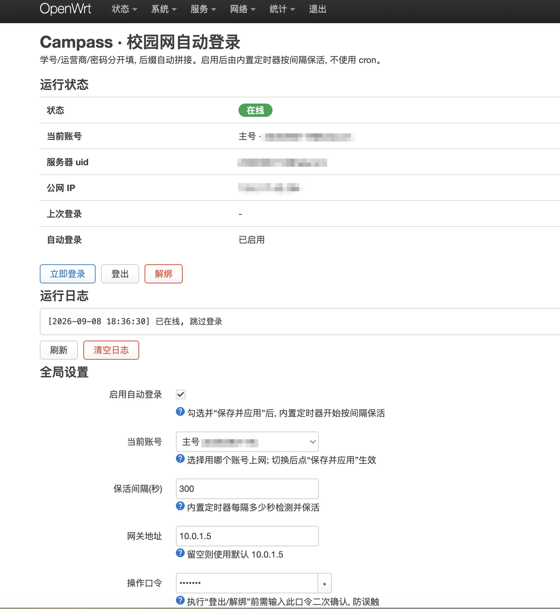
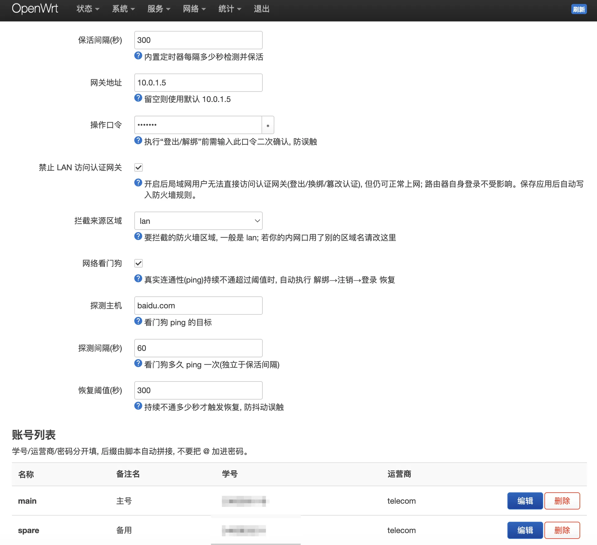

# Campass

> 路由器上的**校园网自动登录 & 保活**服务，为 OpenWrt 打造。

Campass 是一个 Rust 引擎 + LuCI 界面的 OpenWrt 应用：路由器开机 / 掉线自动认证校园网，内置定时保活与网络看门狗，多账号一键切换，彻底告别手写 cron 脚本。

Campass speaks the **Dr.COM / eportal** web-auth protocol used by many Chinese campus networks.




## 特性

- **自动登录** —— 路由器开机 / 掉线自动认证，无需手动点门户页。
- **内置定时器保活** —— procd 服务按间隔检测，未在线即登录；不依赖 cron。
- **网络看门狗** —— 以**独立频率** ping 探测真实连通性，持续不通超过阈值时自动 `解绑 → 注销 → 登录` 恢复。
- **多账号管理** —— LuCI 里增删账号、一键切换当前账号（学号 / 运营商 / 密码分开填，后缀自动拼接）。
- **状态面板 + 运行日志** —— 在线状态、uid、公网 IP、上次登录，实时刷新。
- **登出 / 解绑** —— 危险操作需输入**操作口令**二次确认，防误触断网。
- **防篡改** —— 一键写入防火墙规则，禁止 LAN 用户直接访问认证网关（登出 / 换绑 / 篡改认证），但不影响他们正常上网；拦截来源区域可选。
- **运营商后缀** —— 电信 `@telecom` / 移动 `@cmcc` / 联通 `@unicom` / 广电 `@glgd` / 校园网（无后缀）。

## 组成

| 包 | 内容 |
|----|------|
| `campass` | Rust 引擎 `/usr/bin/campass` + procd 服务 + rpcd 接口 + UCI 配置 |
| `luci-app-campass` | LuCI 界面（服务 → Campass） |

## 目录结构

```
campass-rs/            Rust 引擎源码（静态 musl 二进制）
pkg/campass/           campass 包（CONTROL + data 安装树）
pkg/luci-app-campass/  LuCI 包
build.sh               交叉编译 + 打包两个 .ipk（无需 OpenWrt SDK）
docs/                  截图
```

## 构建

需要 `cargo-zigbuild` + `zig`（在任意平台交叉出 x86_64 静态 musl 二进制）：

```sh
rustup target add x86_64-unknown-linux-musl
cargo install cargo-zigbuild        # 并安装 zig（brew install zig / 见其文档）
./build.sh                          # 产物在 out/
```

> OpenWrt 的 `.ipk` 是 `debian-binary` + `control.tar.gz` + `data.tar.gz` 三个成员打成的 **gzip tar**（不是 Debian 的 `ar` 归档）。`build.sh` 已按此格式打包。默认目标架构 x86_64，改 `build.sh` 里的 `TARGET` / `arch` 即可适配其它路由器。

## 安装

```sh
scp out/campass_*.ipk out/luci-app-campass_*.ipk root@路由器:/tmp/
ssh root@路由器 'opkg install /tmp/campass_*.ipk /tmp/luci-app-campass_*.ipk'
```

安装后服务默认**休眠**（`enabled=0`）。进 LuCI **服务 → Campass**，填好账号、勾选「启用自动登录」并保存应用即可。

## 命令行

```
campass login      读取当前账号并登录（已在线则跳过）
campass logout     注销下线
campass unbind     解绑当前账号在本机的 MAC
campass status     输出 JSON 状态
campass log        输出运行日志
campass daemon     保活 + 看门狗循环（由 procd 拉起）
```

## 配置 `/etc/config/campass`

```
config campass 'global'
	option enabled '0'              # 总开关，LuCI 勾选后置 1
	option active 'main'            # 当前使用的账号 section
	option interval '300'           # 保活间隔（秒）
	option gateway '10.0.1.5'       # 认证网关，留空用默认
	option confirm_word 'campass'   # 登出 / 解绑口令
	option watchdog '1'             # 网络看门狗开关
	option ping_host 'baidu.com'    # 看门狗探测目标
	option watchdog_interval '60'   # 看门狗探测间隔（秒），独立于保活
	option watchdog_threshold '300' # 持续不通多久才恢复（秒）
	option block_lan '0'            # 禁止 LAN 访问认证网关（防篡改）
	option block_zone 'lan'         # 拦截来源防火墙区域

config account 'main'
	option name '主号'
	option student_id '2xxxxxxxxx'
	option isp 'telecom'
	option password '******'
```

## 工作原理

- **登录 / 保活**：`GET http://<网关>/drcom/login?DDDDD=<学号@运营商>&upass=<密码>&...`，成功返回 `{"result":1,...}`。保活前先 `GET /drcom/chkstatus` 判断是否已在线。
- **看门狗**：与保活解耦的独立线程，`ping` 真实外网（默认 baidu.com）；连续不通累计超过 `watchdog_threshold` 才执行「解绑 → 注销 → 登录」，`watchdog_interval` 决定探测频率。防抖动，避免网络轻微波动误触发。
- **防篡改**：`block_lan=1` 时写入一条防火墙规则（`src=<block_zone>`、`dest_ip=<网关>`、`REJECT`），拦截 LAN → 认证网关的**转发**流量。路由器自身对网关的访问是 host OUTPUT，不走转发链，不受影响。

## 安全说明

- 界面上账号列表不再明文展示密码（仅在编辑弹窗里以密码框显示）。但 UCI 配置文件里密码仍为明文存储 —— 这是 OpenWrt 所有服务口令的通用方式，靠 root-only 文件权限保护；且 Dr.COM 协议要求明文提交密码，无法改用哈希。
- 「登出 / 解绑」为危险操作，需输入 `confirm_word` 二次确认，避免误点导致断网。

## License

[MIT](./LICENSE) © 2026 wilinz
